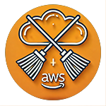

# AWSwipe



Automated AWS resource cleanup tool. Deletes orphaned resources across all regions, reduces costs, maintains account hygiene.

[](LICENSE)

## Why

- Dev/test accounts accumulate unused resources
- Orphaned EBS volumes, snapshots, and EIPs cost money
- Manual cleanup is tedious and error-prone
- AWS doesn't auto-delete your forgotten infrastructure

## Features

| Feature | Description |
|---------|-------------|
| Multi-region | Cleans all AWS regions in parallel |
| Safe by default | Dry-run mode, tag filtering, exclude patterns |
| Comprehensive | EC2, EBS, S3, Lambda, VPC, IAM, RDS, EKS, SageMaker, and more |
| Configurable | YAML config or CLI flags |
| Observable | Structured JSON logging, detailed reports |

## Supported Resources

- EC2 (instances, AMIs, snapshots)
- EBS (volumes)
- S3 (buckets and objects)
- Lambda (functions)
- VPC (subnets, security groups, NAT gateways, etc.)
- IAM (roles, policies, instance profiles)
- ELB/ALB/NLB
- Auto Scaling Groups
- SageMaker (endpoints, endpoint configs, models, notebooks, domains)
- EKS (clusters, nodegroups)
- RDS, ElastiCache, DynamoDB, SQS, SNS
- Route53, CloudFront, Global Accelerator
- CodeBuild, AppRunner, Amplify
- KMS keys, AWS Backup vaults

## Installation

```bash
git clone https://github.com/chernistry/awswipe.git
cd awswipe
pip install -r requirements.txt
```

Requires Python 3.8+ and configured AWS credentials (`aws configure`).

## Usage

```bash
# Dry-run (default) - see what would be deleted
python awswipe.py

# Interactive menu
python awswipe.py --interactive

# Delete everything in specific region
python awswipe.py --region us-east-1 --live-run

# Use config file
python awswipe.py --config config.yaml

# Verbose JSON logs
python awswipe.py -vv --json-logs
```

## Configuration

Copy `config.example.yaml` to `config.yaml`:

```yaml
regions:
  - us-east-1
  - eu-west-1

resource_types:
  - ec2
  - s3
  - lambda

tag_filters:
  include:
    Environment: [dev, test]
  exclude:
    DoNotDelete: ["true"]

exclude_patterns:
  - "prod-*"
  - "critical-*"

dry_run: true
```

## Report Example

```
=== AWS Cleanup Report ===

Resource: S3 Buckets
  Deleted:
    - dev-temp-bucket
    - test-logs-2024
  Failed:
    None

Resource: EC2 Instances
  Deleted:
    - i-0abc123def456gh78
  Failed:
    - i-09xyz987lmn654pq (Permission Denied)
```

## Troubleshooting

| Error | Solution |
|-------|----------|
| `NoCredentialsError` | Run `aws configure` |
| `Permission Denied` | Check IAM permissions |
| `ThrottlingException` | Retry later or reduce concurrency |

## License

MIT

## Author

Alexander Chernysh — [GitHub](https://github.com/chernistry)
